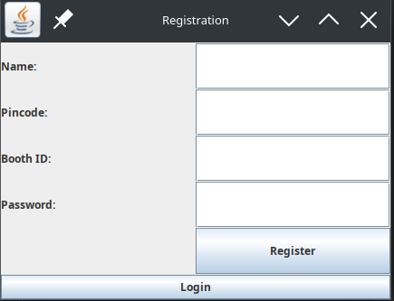
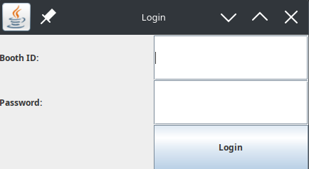
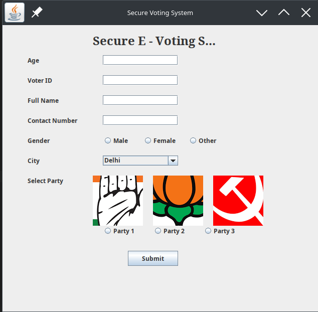
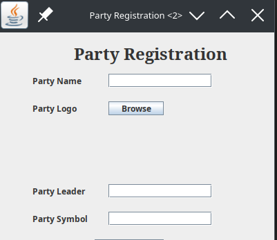
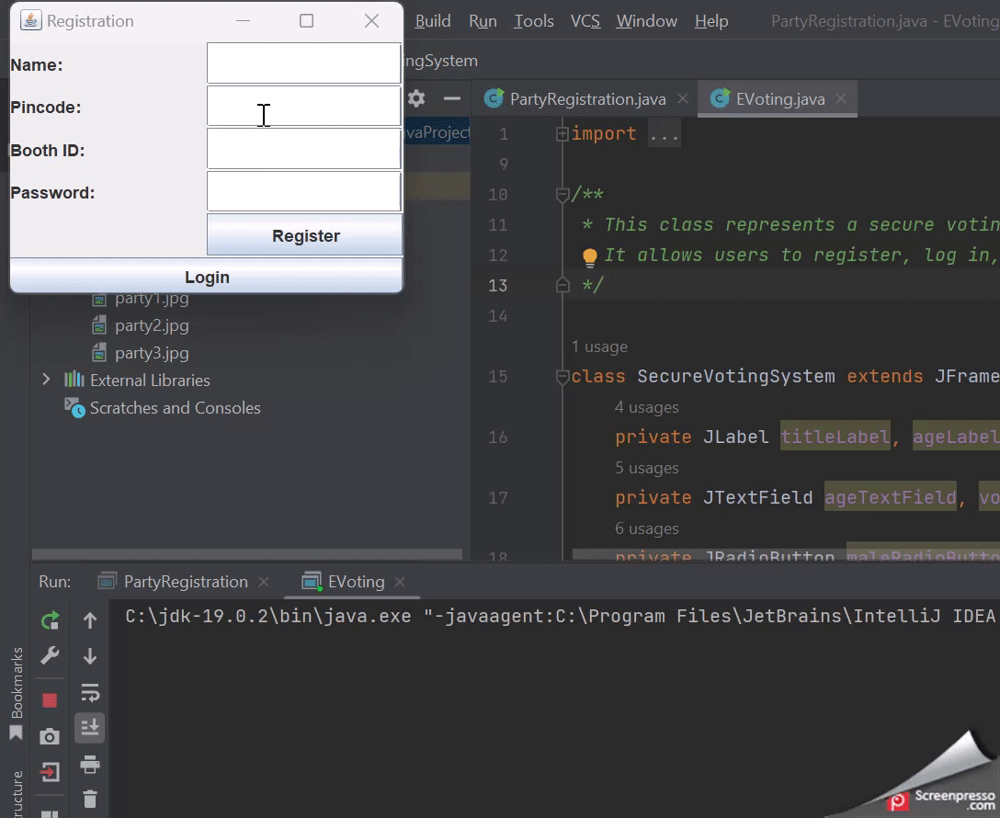
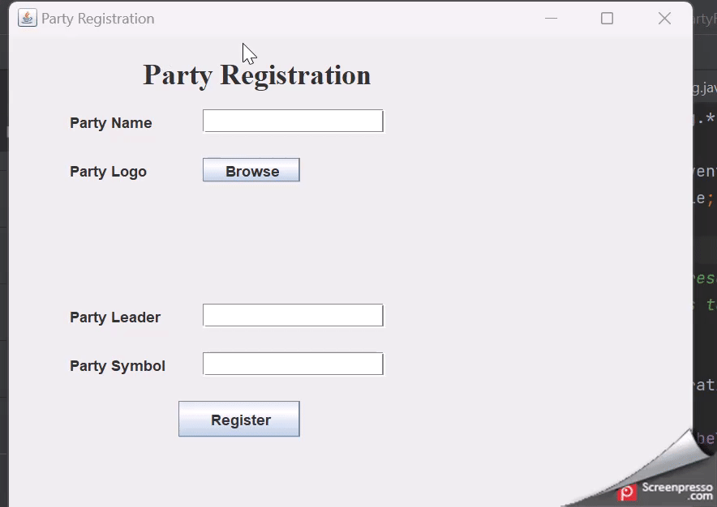

# 20CYS383 Java Programming Lab
  
 
## E - Voting

### Project Description

<p text-align: justify;>The E-Voting System is an electronic voting application built in Java. It gives a user-friendly GUI enabling users to register as voters, register candidates, cast votes, and view voting results. The process seeks to ensure secure and precise vote counting while simplifying the voting process.</p>

### Module Split-up
| Name | Topic |
|------|-------|
| Ravi | Secure E-Voting Fragments |
| Ravi | Count of Votes |
| Mittul | Login Page |
| Mittul | Registration Page |
| Dharmik | Secure E-Voting Fragments |
| Dharmik | Party Registration Party |

### Code

#### EVoting.java
```
package com.amrita.jpl.cys21067.PROJECT;

import javax.swing.*;
import java.awt.*;
import java.awt.event.ActionEvent;
import java.awt.event.ActionListener;
import java.util.HashMap;
import java.util.HashSet;
import java.util.Map;
import java.util.Set;

/**
 * This class represents a secure voting system application.
 * It allows users to register, log in, and vote for a party.
 */
class SecureVotingSystem extends JFrame implements ActionListener {
    private JLabel titleLabel, ageLabel, voterIdLabel, fullNameLabel, contactNumberLabel, genderLabel, cityLabel, partyLabel;
    private JTextField ageTextField, voterIdTextField, fullNameTextField, contactNumberTextField;
    private JRadioButton maleRadioButton, femaleRadioButton, otherRadioButton;
    private JComboBox<String> cityComboBox;
    private JButton submitButton;
    private Set<Integer> voterIds;
    private Map<String, Integer> voteCountMap;
    private ImageIcon party1Icon, party2Icon, party3Icon;
    private JRadioButton party1RadioButton, party2RadioButton, party3RadioButton;
    private JLabel party1Label, party2Label, party3Label;
    private ButtonGroup partyButtonGroup;

    /**
     * Constructs a new SecureVotingSystem object and initializes the UI components.
     */
    public SecureVotingSystem() {
        setTitle("Secure Voting System");
        setSize(600, 500);
        setLayout(null);

        voterIds = new HashSet<>();
        voteCountMap = new HashMap<>();

        titleLabel = new JLabel("Secure E - Voting System");
        titleLabel.setFont(new Font("Serif", Font.BOLD, 24));
        titleLabel.setBounds(180, 10, 250, 40);
        add(titleLabel);

        // Other UI component initialization and configuration...

        setVisible(true);
    }

    /**
     * Handles the actionPerformed event for the submitButton.
     * Collects user input, validates it, and processes the vote.
     *
     * @param e The ActionEvent instance.
     */
    public void actionPerformed(ActionEvent e) {
        String ageText = ageTextField.getText();
        String voterIdText = voterIdTextField.getText();
        String fullName = fullNameTextField.getText();
        String contactNumber = contactNumberTextField.getText();
        String gender = "";
        if (maleRadioButton.isSelected()) {
            gender = "Male";
        } else if (femaleRadioButton.isSelected()) {
            gender = "Female";
        } else if (otherRadioButton.isSelected()) {
            gender = "Other";
        }
        String city = (String) cityComboBox.getSelectedItem();

        ImageIcon selectedPartyIcon = null;
        String selectedParty = "";
        if (party1RadioButton.isSelected()) {
            selectedPartyIcon = party1Icon;
            selectedParty = "Party 1";
        } else if (party2RadioButton.isSelected()) {
            selectedPartyIcon = party2Icon;
            selectedParty = "Party 2";
        } else if (party3RadioButton.isSelected()) {
            selectedPartyIcon = party3Icon;
            selectedParty = "Party 3";
        }

        if (ageText.isEmpty() || voterIdText.isEmpty() || fullName.isEmpty() || contactNumber.isEmpty() || gender.isEmpty() || city.isEmpty()) {
            JOptionPane.showMessageDialog(this, "Fill in all the details first.", "Incomplete Form", JOptionPane.ERROR_MESSAGE);
        } else {
            if (!isNumeric(voterIdText)) {
                JOptionPane.showMessageDialog(this, "Invalid voter ID. Please enter a numeric value.", "Invalid Input", JOptionPane.ERROR_MESSAGE);
                return;
            }

            int age = Integer.parseInt(ageText);
            int voterId = Integer.parseInt(voterIdText);

            if (age < 18) {
                JOptionPane.showMessageDialog(this, "Age below 18. Not eligible to vote.", "Age Restriction", JOptionPane.ERROR_MESSAGE);
            } else {
                if (voterIds.contains(voterId)) {
                    JOptionPane.showMessageDialog(this, "This voter ID is already registered. Please enter a unique voter ID.", "Duplicate Voter ID", JOptionPane.ERROR_MESSAGE);
                } else {
                    voterIds.add(voterId);
                    JOptionPane.showMessageDialog(this, "Thank you for your vote! The party you voted for is " + selectedParty + ".");
                    incrementVoteCount(selectedParty);
                    displayVoteCounts(); // Display the vote counts
                }
            }

            // Clear the text fields
            ageTextField.setText("");
            voterIdTextField.setText("");
            fullNameTextField.setText("");
            contactNumberTextField.setText("");

            // Clear the radio buttons
            maleRadioButton.setSelected(false);
            femaleRadioButton.setSelected(false);
            otherRadioButton.setSelected(false);

            // Clear the combo box selection
            cityComboBox.setSelectedIndex(0);

            // Clear the party selection
            partyButtonGroup.clearSelection();
        }
    }

    /**
     * Checks if a given string is numeric.
     *
     * @param str The string to check.
     * @return true if the string is numeric, false otherwise.
     */
    private boolean isNumeric(String str) {
        return str.matches("\\d+");
    }

    /**
     * Increments the vote count for a given party.
     *
     * @param party The party to increment the vote count for.
     */
    private void incrementVoteCount(String party) {
        voteCountMap.put(party, voteCountMap.getOrDefault(party, 0) + 1);
    }

    /**
     * Displays the vote counts for all parties.
     */
    private void displayVoteCounts() {
        for (Map.Entry<String, Integer> entry : voteCountMap.entrySet()) {
            String party = entry.getKey();
            int voteCount = entry.getValue();
            System.out.println(party + ": " + voteCount);
        }
    }
}

/**
 * This class represents the registration user interface for the voting system.
 * It allows users to register by providing their details.
 */
class RegistrationUI {
    private JFrame frame;
    private JTextField nameTextField, phoneTextField, voterIdTextField;
    private JPasswordField passwordField;

    /**
     * Constructs a new RegistrationUI object and initializes the registration UI components.
     */
    public RegistrationUI() {
        frame = new JFrame("Registration");
        frame.setDefaultCloseOperation(JFrame.EXIT_ON_CLOSE);
        frame.setSize(300, 220);
        frame.setLayout(new BorderLayout());

        // Other UI component initialization and configuration...

        frame.setVisible(true);
    }

    // Other methods...
}

/**
 * This class represents the login user interface for the voting system.
 * It allows registered users to log in to the system.
 */
class LoginUI {
    private JFrame frame;
    private JTextField usernameTextField;
    private JPasswordField passwordField;
    private Map<String, char[]> registeredUsers;

    /**
     * Constructs a new LoginUI object and initializes the login UI components.
     */
    public LoginUI() {
        frame = new JFrame("Login");
        frame.setDefaultCloseOperation(JFrame.EXIT_ON_CLOSE);
        frame.setSize(300, 150);
        frame.setLayout(new BorderLayout());

        // Other UI component initialization and configuration...

        frame.setVisible(true);

        registeredUsers = new HashMap<>();  // Initialize the registered users map
        // Add dummy user for testing
        registeredUsers.put("12345", "password".toCharArray());
    }

    // Other methods...
}

/**
 * The main class that starts the secure voting system application.
 */
public class EVoting {
    /**
     * The main entry point of the application.
     *
     * @param args The command-line arguments.
     */
    public static void main(String[] args) {
        SwingUtilities.invokeLater(new Runnable() {
            @Override
            public void run() {
                new RegistrationUI();
            }
        });
    }
}

```
#### PartyRegistration.java
```
package com.amrita.jpl.cys21067.PROJECT;

import javax.swing.*;
import java.awt.*;
import java.awt.event.*;
import java.io.File;

/**
 * This class represents the party registration form.
 * It allows users to register a new political party by providing the party details and logo.
 */
class PartyRegistration extends JFrame implements ActionListener {
    JLabel titleLabel, partyNameLabel, partyLogoLabel, partyLeaderLabel, partySymbolLabel;
    JTextField partyNameTextField, partyLeaderTextField, partySymbolTextField;
    JButton browseButton, submitButton;
    JLabel selectedLogoLabel;
    File selectedLogoFile;

    /**
     * Constructs a new PartyRegistration object and initializes the party registration UI components.
     */
    public PartyRegistration() {
        setTitle("Party Registration");
        setSize(400, 350);
        setLayout(null);

        titleLabel = new JLabel("Party Registration");
        titleLabel.setFont(new Font("Serif", Font.BOLD, 24));
        titleLabel.setBounds(110, 10, 250, 40);
        add(titleLabel);

        partyNameLabel = new JLabel("Party Name");
        partyNameLabel.setBounds(50, 60, 100, 20);
        add(partyNameLabel);

        partyNameTextField = new JTextField();
        partyNameTextField.setBounds(160, 60, 150, 20);
        add(partyNameTextField);

        partyLogoLabel = new JLabel("Party Logo");
        partyLogoLabel.setBounds(50, 100, 100, 20);
        add(partyLogoLabel);

        browseButton = new JButton("Browse");
        browseButton.setBounds(160, 100, 80, 20);
        browseButton.addActionListener(this);
        add(browseButton);

        selectedLogoLabel = new JLabel();
        selectedLogoLabel.setBounds(250, 100, 100, 100);
        add(selectedLogoLabel);

        partyLeaderLabel = new JLabel("Party Leader");
        partyLeaderLabel.setBounds(50, 220, 100, 20);
        add(partyLeaderLabel);

        partyLeaderTextField = new JTextField();
        partyLeaderTextField.setBounds(160, 220, 150, 20);
        add(partyLeaderTextField);

        partySymbolLabel = new JLabel("Party Symbol");
        partySymbolLabel.setBounds(50, 260, 100, 20);
        add(partySymbolLabel);

        partySymbolTextField = new JTextField();
        partySymbolTextField.setBounds(160, 260, 150, 20);
        add(partySymbolTextField);

        submitButton = new JButton("Register");
        submitButton.setBounds(140, 300, 100, 30);
        submitButton.addActionListener(this);
        add(submitButton);

        setVisible(true);
    }

    /**
     * Handles the actionPerformed event for the browseButton and submitButton.
     * Performs actions based on the event source.
     *
     * @param e The ActionEvent instance.
     */
    public void actionPerformed(ActionEvent e) {
        if (e.getSource() == browseButton) {
            JFileChooser fileChooser = new JFileChooser();
            int result = fileChooser.showOpenDialog(this);
            if (result == JFileChooser.APPROVE_OPTION) {
                selectedLogoFile = fileChooser.getSelectedFile();
                ImageIcon logoIcon = new ImageIcon(selectedLogoFile.getPath());
                selectedLogoLabel.setIcon(logoIcon);
            }
        } else if (e.getSource() == submitButton) {
            String partyName = partyNameTextField.getText();
            String partyLeader = partyLeaderTextField.getText();
            String partySymbol = partySymbolTextField.getText();

            if (partyName.isEmpty() || partyLeader.isEmpty() || partySymbol.isEmpty() || selectedLogoFile == null) {
                JOptionPane.showMessageDialog(this, "Fill in all the details first.", "Incomplete Form", JOptionPane.ERROR_MESSAGE);
            } else {
                // Add your code here to handle party registration
                // ...

                JOptionPane.showMessageDialog(this, "Party registered successfully!");
                partyNameTextField.setText("");
                partyLeaderTextField.setText("");
                partySymbolTextField.setText("");
                selectedLogoLabel.setIcon(null);
                selectedLogoFile = null;
            }
        }
    }

    /**
     * The main entry point of the application.
     *
     * @param args The command-line arguments.
     */
    public static void main(String[] args) {
        new PartyRegistration();
    }
}

```

### Demo
#### Screenshots

<center></center>
<center></center>
<center></center>
<center></center>

#### Video




